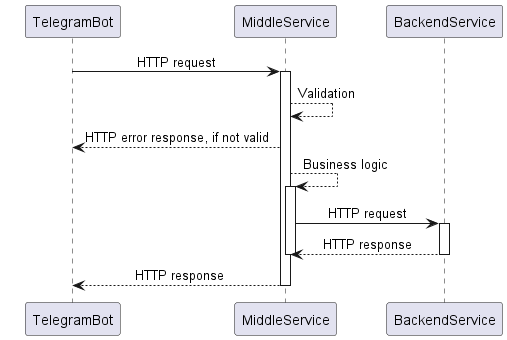
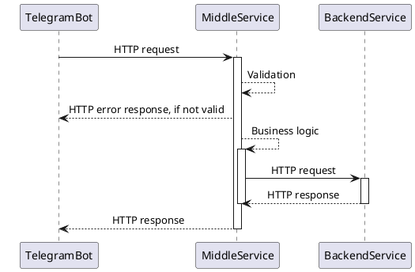

# Middle Service приложения Мини-банк

[](https://github.com/gpb-it-factory/gladskoy-middle-service/actions/workflows/gradle-ci.yml)
[](https://github.com/gpb-it-factory/gladskoy-middle-service/actions/workflows/gradle-ci.yml)
[](https://github.com/gpb-it-factory/gladskoy-middle-service/actions/workflows/gradle-ci.yml)

Middle Service - это один из компонентов "Мини-банка", приложения разрабатываемого в рамках программы [GPB IT Factory Backend 2024](https://gpb.fut.ru/itfactory/backend).
Сервис принимает запросы от Telegram-бота, выполняет валидацию и бизнес-логику, а так же маршрутизирует запросы в Backend Service.


1. [Локальный запуск](#локальный-запуск)
2. [Архитектура системы](#архитектура-системы)
3. [Интеграции](#интеграции)


### Локальный запуск

1. Клонировать репозиторий
    ```bash
    git clone git@github.com:gpb-it-factory/gladskoy-middle-service.git
    ```
2. Перейти в директорию с проектом
   ```bash
   cd gladskoy-middle-service
3. Запустить приложение
    ```bash
    ./gradlew bootRun
    ```

REST API контракт сервиса находится в директории [openapi](src/main/resources/openapi/middle-service.yaml)

### Архитектура системы



<details>


</details>


### Интеграции

- [Telegram Bot](https://github.com/gpb-it-factory/gladskoy-telegram-bot)
- [Backend Service]() // TBD
